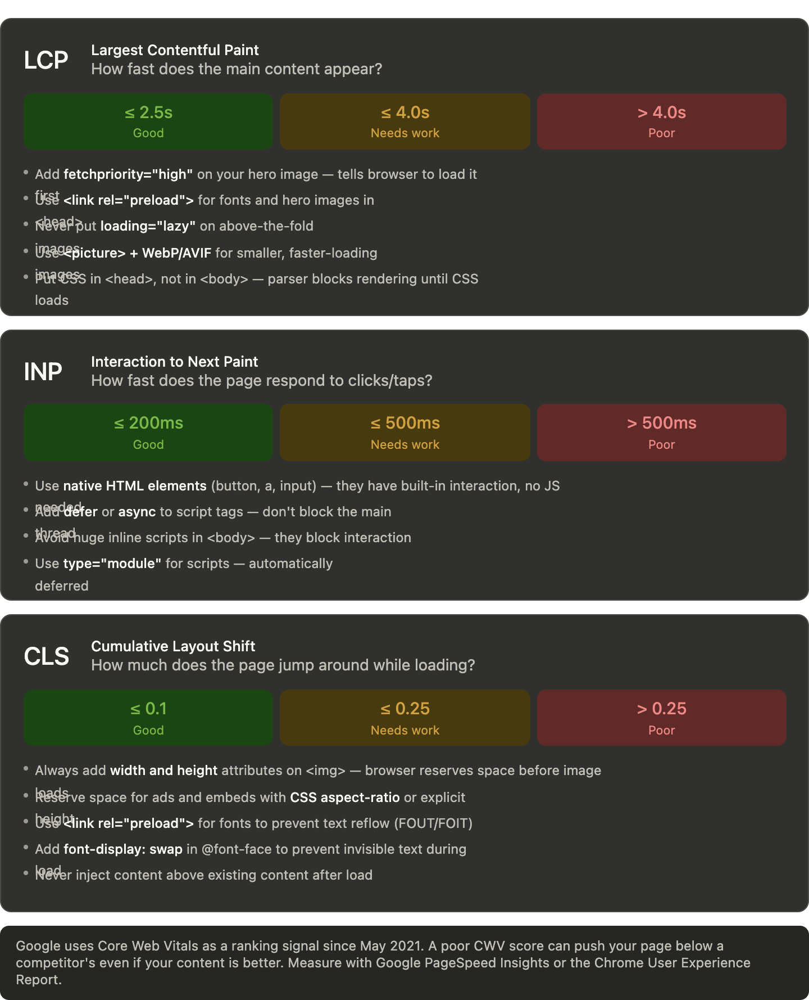
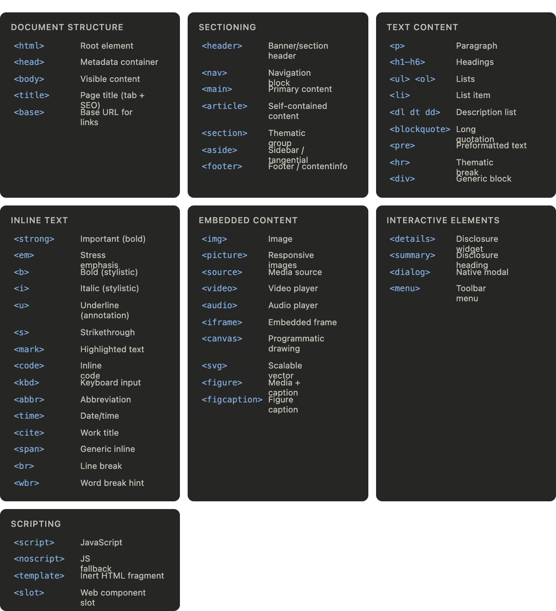

# 📚The Complete HTML Masterclass Basic to Advanced

This is going to be a complete, deeply detailed HTML masterclass  from the very first tag to advanced SEO, semantics, web vitals, and everything in between. Let's build this chapter by chapter.

## Part 1: What HTML Actually Is

Before any tag, you must understand this: **HTML is not a programming language. It is a markup language.** It doesn't have logic, conditions, or loops. It has one job  to describe the *structure and meaning* of content. Think of it as labeling. 

HTML stands for **HyperText Markup Language**. HyperText = text with links (hyper = beyond). Markup = tags that annotate content. Language = a defined, consistent syntax.

Every HTML document follows the same skeleton:

```html
<!DOCTYPE html>
<html lang="en">
  <head>
    <meta charset="UTF-8">
    <meta name="viewport" content="width=device-width, initial-scale=1.0">
    <title>My Page</title>
  </head>
  <body>
    <!-- Everything visible goes here -->
  </body>
</html>
```

`<!DOCTYPE html>` tells the browser: "parse this as modern HTML5." Without it, browsers enter "quirks mode" a compatibility mode that mimics old, broken browser behavior. Always include it.

`<html lang="en">`  the `lang` attribute is not decorative. Screen readers use it to choose the right voice engine. Search engines use it for language targeting. Always specify it.

The `<head>` is invisible to users but critical to machines  browsers, crawlers, social media scrapers all read it. The `<body>` is everything the user sees.

---

## Part 2: Headings ( H1 to H6)

Headings are the most misunderstood tags in HTML. Students think they're about font size. They're not. They're about **document outline and semantic hierarchy**.The most important rule: **never skip heading levels.** Going H1 → H3 is like jumping from Chapter 1 to Section 1.3 without having Section 1. Screen readers build a table of contents from headings  skipped levels break it. Google uses heading structure to understand your content hierarchy  skipped levels confuse it.

---

## Part 3: Semantic HTML The Most Important Concept in Modern HTML

This is where most developers even experienced ones get it wrong. Semantic HTML means using the tag that *accurately describes the meaning* of the content, not just the one that looks right visually.

Compare these two:

```html
<!-- Non-semantic — works visually but meaningless -->
<div class="header">
  <div class="nav">
    <div class="nav-item">Home</div>
  </div>
</div>
<div class="main-content">
  <div class="article">...</div>
</div>
<div class="footer">...</div>

<!-- Semantic — same visual result, rich meaning -->
<header>
  <nav>
    <a href="/">Home</a>
  </nav>
</header>
<main>
  <article>...</article>
</main>
<footer>...</footer>
```

Both render identically. But the semantic version tells Google, screen readers, and other machines what each region *is*. The `<nav>` tells Google "these are navigation links." The `<article>` tells a screen reader "this is a self-contained piece of content." The `<footer>` tells a scraper "this is page metadata."The landmark roles are a big deal in accessibility. A blind user with a screen reader can press a key to jump directly to `<main>`, skipping the nav. If you use `<div>` everywhere, that ability disappears.

---

## Part 4: Text-Level Semantic Tags The Inline Elements

These go *inside* paragraphs and headings. Each has specific meaning that affects accessibility, SEO, and styling.

```html
<p>
  The word <strong>danger</strong> carries high importance.
  The word <em>slowly</em> is being emphasized for tone.
  The abbreviation <abbr title="HyperText Markup Language">HTML</abbr> is explained on hover.
  This is a <mark>highlighted passage</mark> for reference.
  The price dropped from <del>₹500</del> to <ins>₹350</ins>.
  The formula is H<sub>2</sub>O and E=mc<sup>2</sup>.
  The error code was <code>404 Not Found</code>.
  Press <kbd>Ctrl</kbd> + <kbd>S</kbd> to save.
  The output was <samp>Hello, World!</samp>.
  The variable is defined as <var>x</var>.
  <q>To be or not to be</q> is a famous quote.
  <cite>Hamlet</cite> was written by Shakespeare.
  This is <small>fine print or legal text</small>.
  A word break opportunity: super<wbr>cali<wbr>fragilistic
  <time datetime="2025-01-15">January 15, 2025</time>
</p>
```

The distinction between `<strong>` and `<b>`, and between `<em>` and `<i>` is critical to teach:

`<strong>` = important content (semantic). Screen readers may announce it. `<b>` = bold for stylistic reasons, no meaning.
`<em>` = stress emphasis that changes meaning (semantic). `<i>` = italic for technical terms, foreign words, thoughts  no stress emphasis.

So "I never said she *stole* the money" uses `<em>` on "stole" because that emphasis changes the meaning. A book title in italics uses `<i>`.

---

## Part 5: Lists : Three Types, All Different

```html
<!-- Unordered list — bullets, order doesn't matter -->
<ul>
  <li>Milk</li>
  <li>Eggs</li>
  <li>Bread</li>
</ul>

<!-- Ordered list — numbered, order matters -->
<ol type="1" start="1">  <!-- type can be: 1, A, a, I, i -->
  <li>Preheat oven to 180°C</li>
  <li>Mix ingredients</li>
  <li>Bake for 25 minutes</li>
</ol>

<!-- Ordered list reversed (countdown) -->
<ol reversed>
  <li>Third place</li>
  <li>Second place</li>
  <li>First place</li>
</ol>

<!-- Description list — term/definition pairs -->
<dl>
  <dt>HTML</dt>
  <dd>HyperText Markup Language — the structure of web pages</dd>

  <dt>CSS</dt>
  <dd>Cascading Style Sheets — the presentation of web pages</dd>
</dl>
```

`<dl>` is severely underused. It's perfect for glossaries, FAQs (term = question, definition = answer), metadata displays, and key-value pairs. It's also semantically correct for those use cases in a way that a styled table wouldn't be.

Lists can be nested  a `<ul>` inside an `<li>` creates a sub-list. The browser handles indentation automatically, though you'll override it with CSS.

---

## Part 6: Links : The Foundation of the Web

The `<a>` element is what makes the web a *web*. Every link is an `<a>` tag.

```html
<!-- Basic link -->
<a href="https://example.com">Visit Example</a>

<!-- Open in new tab — always add rel for security -->
<a href="https://example.com" target="_blank" rel="noopener noreferrer">
  External Site
</a>

<!-- Link to page section (anchor link) -->
<a href="#section-2">Jump to Section 2</a>
<h2 id="section-2">Section 2</h2>

<!-- Email link -->
<a href="mailto:hello@example.com">Email us</a>

<!-- Phone link (works on mobile) -->
<a href="tel:+919876543210">Call us</a>

<!-- Download link -->
<a href="/files/resume.pdf" download="MyResume.pdf">Download Resume</a>

<!-- Link with meaningful text — GOOD for SEO and accessibility -->
<a href="/html-guide">Read our complete HTML guide</a>

<!-- Link with meaningless text — BAD -->
<a href="/html-guide">Click here</a>  <!-- Never do this -->
```

The `rel="noopener noreferrer"` on `target="_blank"` links is a security requirement. Without it, the opened tab can access your page via `window.opener` a known security vulnerability called reverse tabnapping.

Link text matters enormously for both SEO and accessibility. Screen readers read out all the links on a page as a list  "click here, click here, click here" is useless. "Complete HTML Guide, CSS Tutorial, JavaScript Basics" is meaningful.

---

## Part 7: Images : Far More Than ``

```html
<!-- Basic image — alt is mandatory -->


<!-- Decorative image — empty alt, screen reader skips it -->


<!-- Responsive image — different sizes for different screens -->


<!-- Modern formats with fallback -->
<picture>
  <source srcset="photo.avif" type="image/avif">
  <source srcset="photo.webp" type="image/webp">
  
</picture>

<!-- Figure with caption -->
<figure>
  
  <figcaption>Monthly sales for Q3 2025. Data from internal CRM.</figcaption>
</figure>
```

The `width` and `height` attributes on `` are not just for sizing  they tell the browser the aspect ratio *before* the image loads, preventing layout shift (a Core Web Vital metric). Always include them.

`loading="lazy"` defers loading of images below the fold, dramatically improving initial page load speed. Use it on every image that isn't in the viewport on load.

---

## Part 8: Tables : Structure and Accessibility

Tables are for *tabular data*  not for layout. This was abused heavily in the 1990s and early 2000s. A correctly structured table is fully accessible and semantically meaningful.

```html
<table>
  <caption>Monthly Sales Report — Q3 2025</caption>

  <thead>
    <tr>
      <th scope="col">Month</th>
      <th scope="col">Revenue</th>
      <th scope="col">Orders</th>
      <th scope="col">Growth</th>
    </tr>
  </thead>

  <tbody>
    <tr>
      <th scope="row">July</th>
      <td>₹1,20,000</td>
      <td>340</td>
      <td>+12%</td>
    </tr>
    <tr>
      <th scope="row">August</th>
      <td>₹1,45,000</td>
      <td>390</td>
      <td>+20%</td>
    </tr>
  </tbody>

  <tfoot>
    <tr>
      <th scope="row">Total</th>
      <td>₹2,65,000</td>
      <td>730</td>
      <td></td>
    </tr>
  </tfoot>
</table>
```

The `scope` attribute on `<th>` is the key to table accessibility. `scope="col"` means this header describes a column. `scope="row"` means this header describes a row. Screen readers use this to announce "July, Revenue: ₹1,20,000" rather than just reading numbers in isolation.

`<caption>` is the table's title  read first by screen readers and useful for SEO. `<thead>`, `<tbody>`, and `<tfoot>` let browsers render the body independently (useful for long scrollable tables) and give structure for styling.

---

## Part 9: Forms :The Most Complex HTML Topic

Forms are how users send data to servers. They're also the most complex part of HTML because every element has specific behaviors, attributes, and accessibility requirements.A complete, correct form looks like this:

```html
<form action="/submit" method="POST" novalidate>
  <fieldset>
    <legend>Personal Information</legend>

    <div class="form-group">
      <label for="full-name">Full name <span aria-hidden="true">*</span></label>
      <input
        type="text"
        id="full-name"
        name="fullName"
        required
        autocomplete="name"
        aria-required="true"
        aria-describedby="name-hint"
      >
      <span id="name-hint">Enter your name as it appears on official documents</span>
    </div>

    <div class="form-group">
      <label for="email">Email address</label>
      <input
        type="email"
        id="email"
        name="email"
        autocomplete="email"
        required
      >
    </div>

    <fieldset>
      <legend>Preferred contact method</legend>
      <label><input type="radio" name="contact" value="email"> Email</label>
      <label><input type="radio" name="contact" value="phone"> Phone</label>
    </fieldset>

  </fieldset>

  <button type="submit">Submit form</button>
</form>
```

---

## Part 10: Meta Tags : The Invisible Power of `<head>`

Meta tags live in `<head>` and are invisible to users but critical for search engines, social media, and browsers.A complete, production-ready `<head>` looks like this:

```html
<head>
  <meta charset="UTF-8">
  <meta name="viewport" content="width=device-width, initial-scale=1.0">
  <title>Best HTML Course for Beginners | LearnWeb India</title>
  <meta name="description" content="Learn HTML from scratch in 30 days. Covers semantic HTML, forms, tables, SEO, and accessibility. Free course by LearnWeb India.">
  <link rel="canonical" href="https://learnweb.in/html-course">

  <!-- Open Graph -->
  <meta property="og:title" content="Best HTML Course for Beginners">
  <meta property="og:description" content="Learn HTML from scratch in 30 days.">
  <meta property="og:image" content="https://learnweb.in/images/html-course-og.jpg">
  <meta property="og:url" content="https://learnweb.in/html-course">
  <meta property="og:type" content="website">

  <!-- Twitter -->
  <meta name="twitter:card" content="summary_large_image">
  <meta name="twitter:title" content="Best HTML Course for Beginners">
  <meta name="twitter:image" content="https://learnweb.in/images/html-course-og.jpg">

  <!-- Robots -->
  <meta name="robots" content="index, follow">

  <!-- Favicon -->
  <link rel="icon" type="image/png" href="/favicon.png">
  <link rel="apple-touch-icon" href="/apple-touch-icon.png">

  <!-- Preconnect for performance -->
  <link rel="preconnect" href="https://fonts.googleapis.com">

  <!-- Theme color -->
  <meta name="theme-color" content="#ffffff">
</head>
```

---

## Part 11: SEO in HTML : The Complete Picture

SEO from HTML perspective is not just meta tags. It's the entire document structure.

**Title tag** is the single highest-value SEO element. Format: `Primary Keyword — Secondary Keyword | Brand Name`. Keep it under 60 characters (Google truncates at ~580px width). Each page must have a unique title.

**URL structure** (controlled by your server, referenced by HTML canonical): Clean, readable, keyword-rich URLs. `example.com/html-forms-tutorial` beats `example.com/page?id=234`.

**Structured Data (Schema.org)** is HTML's secret SEO weapon. It's JSON-LD embedded in `<script>` tags that tells Google exactly what your content is:

```html
<script type="application/ld+json">
{
  "@context": "https://schema.org",
  "@type": "Article",
  "headline": "Complete Guide to HTML Forms",
  "author": {
    "@type": "Person",
    "name": "Rahul Sharma"
  },
  "datePublished": "2025-01-15",
  "description": "A complete guide to all HTML form elements...",
  "image": "https://example.com/html-forms-og.jpg"
}
</script>
```

This enables **rich results** in Google  star ratings, FAQs, breadcrumbs, event dates shown directly in search results. Pages with rich results get significantly higher click-through rates.

Other Schema types: `FAQPage`, `HowTo`, `Product`, `LocalBusiness`, `BreadcrumbList`, `Course`, `Recipe`.

**Internal linking** with descriptive anchor text passes authority between pages and helps Google discover content. Link from high-authority pages to newer pages. Use keyword-rich anchor text.

**Image alt text** is read by Google as content. It also helps your images appear in Google Image Search. Write it as a sentence describing what's in the image, including keywords where natural.

**Page speed** is a direct Google ranking factor since 2021. This is where HTML decisions matter lazy loading images, preloading critical fonts, avoiding render-blocking scripts.

---

## Part 12: Core Web Vitals : HTML's Impact on Google's Page Experience Signals

Core Web Vitals are three specific performance metrics that Google uses as ranking signals:The HTML changes that have the biggest CWV impact: always set `width` and `height` on images (prevents CLS), never lazy-load hero images (improves LCP), and always `defer` or `async` your scripts (improves INP).



---

## Part 13: Less-Known but Powerful HTML Tags

These are the gems most developers never teach:

```html
<!-- details/summary — native accordion, no JavaScript needed -->
<details>
  <summary>Click to expand this section</summary>
  <p>This content is hidden by default and revealed on click.
  Google indexes both open and closed content.</p>
</details>

<!-- dialog — native modal dialog -->
<dialog id="my-modal">
  <h2>Are you sure?</h2>
  <p>This action cannot be undone.</p>
  <button onclick="document.getElementById('my-modal').close()">Cancel</button>
  <button>Confirm</button>
</dialog>
<button onclick="document.getElementById('my-modal').showModal()">Open modal</button>

<!-- progress — native progress bar -->
<label for="upload">Upload progress:</label>
<progress id="upload" value="65" max="100">65%</progress>

<!-- meter — a measurement within a known range -->
<label for="disk">Disk usage:</label>
<meter id="disk" value="6" min="0" max="10" low="3" high="8" optimum="2">6GB</meter>

<!-- datalist — searchable dropdown suggestions -->
<input list="cities" name="city" placeholder="Type a city...">
<datalist id="cities">
  <option value="Mumbai">
  <option value="Delhi">
  <option value="Bangalore">
  <option value="Chennai">
  <option value="Hyderabad">
</datalist>

<!-- output — result of a calculation -->
<form oninput="result.value = parseInt(a.value) + parseInt(b.value)">
  <input type="number" id="a" value="10"> +
  <input type="number" id="b" value="20"> =
  <output name="result">30</output>
</form>

<!-- template — inert HTML fragment, used by JavaScript -->
<template id="card-template">
  <div class="card">
    <h3 class="card-title"></h3>
    <p class="card-body"></p>
  </div>
</template>

<!-- ruby — East Asian text annotation (pronunciation guides) -->
<ruby>
  漢 <rt>かん</rt>
  字 <rt>じ</rt>
</ruby>

<!-- bdi — isolates text direction (for user-generated content mixing RTL/LTR) -->
<p>User <bdi>مرحبا</bdi> posted 15 times.</p>

<!-- wbr — word break opportunity (for long URLs or compound words) -->
<p>This is a very long URL: https://example.com/very<wbr>/long<wbr>/path<wbr>/here</p>
```

The `<details>` + `<summary>` combo is extraordinary  it creates a fully functional accordion with zero JavaScript and it's keyboard-navigable out of the box. Google can read the hidden content for SEO. Use it for FAQs.

The `<dialog>` element is a native modal that handles focus trapping (keeps keyboard focus inside the modal) and backdrop automatically  things that took hundreds of lines of JavaScript before.

---

## Part 14: Accessibility in HTML : ARIA

ARIA (Accessible Rich Internet Applications) is a set of attributes that extend HTML's semantics for screen readers. The first rule of ARIA: **don't use ARIA when native HTML can do the job.** A `<button>` is already accessible. Adding ARIA to a `<div>` to make it a button is always worse.

```html
<!-- Roles — override the implicit semantic -->
<div role="alert">Your session will expire in 5 minutes.</div>
<div role="status">Form saved successfully.</div>  <!-- polite version -->

<!-- Labels — name elements for screen readers -->
<button aria-label="Close dialog">X</button>  <!-- "X" alone is meaningless -->
<nav aria-label="Primary navigation">...</nav>
<nav aria-label="Footer navigation">...</nav>  <!-- distinguish multiple navs -->

<!-- Descriptions — additional context -->
<input type="password" aria-describedby="pwd-rules">
<p id="pwd-rules">Must be 8+ characters with a number and symbol.</p>

<!-- States -->
<button aria-expanded="false" aria-controls="menu">Menu</button>
<ul id="menu" hidden>...</ul>

<!-- Live regions — announce dynamic changes -->
<div aria-live="polite" aria-atomic="true">
  <!-- Content injected here gets announced by screen readers -->
</div>

<!-- Hidden from screen readers (decorative) -->
<svg aria-hidden="true">...</svg>
<span aria-hidden="true">→</span>  <!-- decorative arrow -->
```

The `aria-live` attribute is how you make dynamic content (loading states, error messages, chat messages) accessible  without it, screen reader users miss all content that changes after page load.

---

## Part 15: HTML Performance Techniques

```html
<!-- Preload critical resources -->
<link rel="preload" href="/fonts/main.woff2" as="font" type="font/woff2" crossorigin>
<link rel="preload" href="/hero.jpg" as="image">
<link rel="preload" href="/critical.css" as="style">

<!-- Preconnect to external domains (warm up the connection) -->
<link rel="preconnect" href="https://fonts.googleapis.com">
<link rel="preconnect" href="https://api.example.com">

<!-- DNS prefetch (lighter than preconnect) -->
<link rel="dns-prefetch" href="https://analytics.example.com">

<!-- Prefetch next page (user will likely navigate here) -->
<link rel="prefetch" href="/next-page.html">

<!-- Script loading strategies -->
<script src="app.js" defer></script>      <!-- Download async, execute after HTML parsed -->
<script src="analytics.js" async></script> <!-- Download and execute async, order not guaranteed -->
<script type="module" src="app.js"></script> <!-- Automatically deferred, ES modules -->

<!-- Inline critical CSS (fastest possible render) -->
<style>
  /* Only above-the-fold styles here */
  body { margin: 0; font-family: sans-serif; }
  header { background: #fff; height: 60px; }
</style>
<!-- Then load the rest asynchronously -->
<link rel="stylesheet" href="/styles.css" media="print" onload="this.media='all'">
```

The `defer` vs `async` distinction is something you will be asked in interviews for years:

`defer`: script downloads in parallel with HTML parsing, executes *after* the HTML is fully parsed, in order. Use for most scripts.
`async`: script downloads in parallel, executes *as soon as it downloads* (potentially mid-parse), in no guaranteed order. Use for completely independent scripts like analytics.

---

## Part 16: The `<link>` Tag Beyond Stylesheets

```html
<!-- Favicon variations -->
<link rel="icon" href="/favicon.ico">
<link rel="icon" type="image/png" sizes="32x32" href="/favicon-32.png">
<link rel="icon" type="image/svg+xml" href="/favicon.svg">
<link rel="apple-touch-icon" href="/apple-touch-icon.png">

<!-- Alternate versions -->
<link rel="alternate" hreflang="hi" href="https://example.com/hi/page">
<link rel="alternate" hreflang="en" href="https://example.com/en/page">
<link rel="alternate" hreflang="x-default" href="https://example.com/page">

<!-- RSS/Atom feed -->
<link rel="alternate" type="application/rss+xml" title="My Blog Feed" href="/feed.xml">

<!-- Manifest (for PWA) -->
<link rel="manifest" href="/manifest.json">
```

The `hreflang` tags are crucial for multilingual sites. They tell Google which version of a page is for which language/region. Without them, Google may show the wrong language version to users. `x-default` is shown when no other language matches.

---

## Part 17: The HTML You Should Know Cold  Quick Reference



## Part 18: The HTML Attributes Every Developer Needs

Beyond tag-specific attributes, these global attributes work on every HTML element:

```html
<!-- id — unique identifier, used by CSS, JS, anchor links -->
<section id="contact-section">

<!-- class — for CSS and JS selection, multiple allowed -->
<div class="card featured large">

<!-- style — inline CSS (use sparingly) -->
<p style="color: red; font-weight: bold;">

<!-- data-* — custom data attributes for JS -->
<button data-product-id="42" data-category="electronics">Add to Cart</button>
<!-- Access in JS: button.dataset.productId → "42" -->

<!-- tabindex — keyboard navigation order -->
<div tabindex="0">Focusable div</div>  <!-- 0 = natural order -->
<div tabindex="-1">Programmatically focusable only</div>
<!-- Avoid positive tabindex values — breaks natural flow -->

<!-- contenteditable — makes any element editable -->
<div contenteditable="true">Users can edit this text</div>

<!-- hidden — hides element (like display:none, but semantic) -->
<div hidden>This content is hidden</div>

<!-- draggable — enables HTML drag and drop -->
<div draggable="true">Drag me</div>

<!-- spellcheck -->
<textarea spellcheck="true"></textarea>

<!-- translate — whether to translate this text -->
<code translate="no">console.log("Hello")</code>

<!-- lang — override document language for specific elements -->
<p lang="fr">Bonjour le monde</p>

<!-- dir — text direction -->
<p dir="rtl">مرحبا بالعالم</p>
```

The `data-*` attribute is one of the most powerful and underappreciated features of HTML5. It lets you store custom data directly on elements without invisible form fields or JavaScript variables, and it's instantly accessible via `element.dataset.yourKey`.

---

## Part 19: Video and Audio

```html
<!-- Video with multiple formats + subtitles -->
<video
  width="1280"
  height="720"
  controls
  muted
  autoplay
  loop
  poster="/thumbnail.jpg"
  preload="metadata"
>
  <source src="video.webm" type="video/webm">
  <source src="video.mp4" type="video/mp4">

  <!-- Subtitles / closed captions -->
  <track kind="subtitles" src="subtitles-en.vtt" srclang="en" label="English" default>
  <track kind="subtitles" src="subtitles-hi.vtt" srclang="hi" label="Hindi">

  <!-- Fallback for browsers that don't support video -->
  <p>Your browser doesn't support video. <a href="video.mp4">Download it</a>.</p>
</video>

<!-- Audio -->
<audio controls preload="metadata">
  <source src="podcast.ogg" type="audio/ogg">
  <source src="podcast.mp3" type="audio/mpeg">
</audio>
```

Always include `<track>` elements for video  closed captions are a legal requirement in many countries and a strong accessibility practice everywhere. They're also indexed by Google, making video content searchable.

---

## Part 20: The Rules That Separate Good HTML from Great HTML

These are the principles you should internalize and never forget:

**One: Validate your HTML.** Use validator.w3.org. Invalid HTML has unpredictable rendering across browsers  the parser has to guess what you meant.

**Two: Structure first, style second.** Write the complete, semantic HTML before touching CSS. If your structure is wrong, no amount of CSS fixes it.

**Three: Every image needs alt text.** No exceptions. Either describe it (informative images) or use empty alt="" (decorative). Missing alt is an accessibility violation and hurts SEO.

**Four: Every form input needs a label.** Use `<label for="id">`, not placeholder. Not wrapping text. An actual `<label>` element with a matching `for` attribute.

**Five: Use the right element for the job.** Buttons do things. Links go places. Never use one for the other. A `<button>` that navigates to a page should be `<a>`. A `<a>` that submits something should be `<button>`.

**Six: Keyboard navigability.** If a user can't tab to it and activate it with Enter or Space, it's inaccessible to keyboard users and screen reader users  a large percentage of your audience.

**Seven: Heading hierarchy is not optional.** One H1. H2s for major sections. H3s for subsections. Never skip levels. This is both an SEO and an accessibility requirement.

**Eight: The DOM is not your HTML.** What the browser renders is the DOM  the live, in-memory tree. Your HTML file is just the initial instructions. JavaScript can change the DOM entirely after load. Always test what the browser is actually rendering, not just what your file says.

Every one of these points gives you something concrete, testable, and directly applicable to real work. This is the full picture of HTML  from the first tag to production-grade, SEO-optimized, accessible, performant pages. Click any tag in the reference card above to go deeper on any topic.