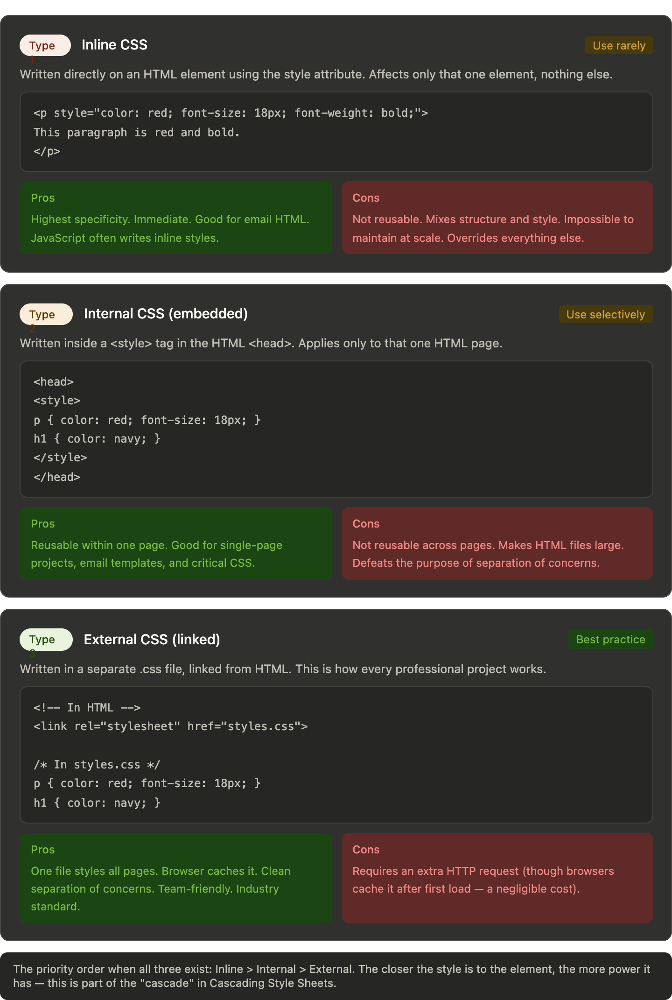

# 📚Complete CSS Masterclass

## Chapter 1: What is CSS, and Why Do We Need It?

Let's start with the honest question: if HTML gives us content, why do we need anything else?

Open any webpage and right-click → "View Page Source." What you're reading is HTML — structure and content. Now imagine if that's all we had. Every website would look identical: black text, Times New Roman, white background, blue underlined links. Headings slightly bigger than paragraphs. That's it. That's the entire visual range of a web without CSS.

**CSS stands for Cascading Style Sheets.** It's a language — not a programming language, but a declaration language — whose entire job is to describe how HTML elements should look and where they should sit on screen.

The analogy that works best for you: **HTML is the skeleton, CSS is everything else.** The bones give you structure. But skin, clothing, hair color, height, posture — all of that is CSS. Two people can have identical skeletons and look completely different. Two websites can have identical HTML and look completely different.

A deeper analogy: think of a book manuscript submitted to a publisher. The manuscript has content — words, paragraphs, chapters. The publisher's design team decides: what font? What size? How much space between lines? What does a chapter heading look like? That design team's decisions — their style guide — is what CSS is. The words never change. Only the presentation does.

This separation is one of the greatest ideas in software engineering. It means:

- You can redesign an entire website without touching a single line of HTML
- You can apply one stylesheet to hundreds of pages and update them all at once
- You can have multiple stylesheets for the same HTML — one for screens, one for print, one for dark mode
- Designers and developers can work independently

---

## Chapter 2: The Three Types of CSS

There are three ways to write CSS, and they each have a specific use case. Most developers use all three.



## Chapter 3: How CSS Actually Works — Syntax, Selectors, and the Cascade

Every CSS rule has the same anatomy:

```css
selector {
  property: value;
  property: value;
}
```

The selector is the question "which elements?" The property-value pairs are the answer to "what should they look like?" That's the entire language. Everything else is learning which selectors exist and which properties do what.

### Selectors — the complete picture

```css
/* Element selector — targets all instances of that tag */
p { color: gray; }
h1 { font-size: 2rem; }

/* Class selector — targets elements with that class */
.card { background: white; }
.btn-primary { background: blue; color: white; }

/* ID selector — targets the one element with that ID */
#hero { height: 100vh; }

/* Attribute selector */
input[type="email"] { border-color: blue; }
a[href^="https"] { color: green; }    /* href starts with https */
a[href$=".pdf"] { color: red; }       /* href ends with .pdf */
a[href*="example"] { color: orange; } /* href contains "example" */

/* Descendant selector — any p inside a .card, no matter how deep */
.card p { line-height: 1.8; }

/* Child selector — only direct children */
.nav > li { display: inline; }

/* Adjacent sibling — h2 immediately after an h1 */
h1 + h2 { margin-top: 0; }

/* General sibling — all h2s that follow an h1 (same parent) */
h1 ~ h2 { color: gray; }

/* Group selector — same rules for multiple selectors */
h1, h2, h3, h4 { font-family: Georgia, serif; }

/* Universal selector — everything (use with caution) */
* { box-sizing: border-box; }
```

### Pseudo-classes — styles based on state

```css
/* Link states */
a:link    { color: blue; }      /* Unvisited */
a:visited { color: purple; }    /* Visited */
a:hover   { color: red; }       /* Hovered */
a:active  { color: orange; }    /* Being clicked */
a:focus   { outline: 2px solid blue; } /* Keyboard focused */

/* Form states */
input:focus   { border-color: blue; }
input:disabled { opacity: 0.5; }
input:checked  { accent-color: green; }
input:required { border-color: red; }
input:valid    { border-color: green; }
input:invalid  { border-color: red; }
input:placeholder-shown { border-style: dashed; }

/* Structural pseudo-classes */
li:first-child    { font-weight: bold; }
li:last-child     { border-bottom: none; }
li:nth-child(2)   { color: red; }       /* exactly the 2nd child */
li:nth-child(odd) { background: #f5f5f5; } /* odd rows */
li:nth-child(even){ background: white; }   /* even rows */
li:nth-child(3n)  { color: blue; }      /* every 3rd: 3, 6, 9... */
p:only-child      { margin: 0; }        /* only child of its parent */
p:not(.special)   { color: gray; }      /* everything except .special */

/* Others */
.card:hover > .overlay { opacity: 1; }
```

### Pseudo-elements — style parts of elements

```css
/* ::before and ::after — generated content, doesn't exist in HTML */
.btn::before {
  content: "→ ";  /* The content property is required */
}
.btn::after {
  content: "";    /* Empty string still lets you create shapes */
  display: block;
  width: 100%;
  height: 2px;
  background: currentColor;
}

/* ::first-line — only the first rendered line of text */
p::first-line { font-variant: small-caps; }

/* ::first-letter — drop cap effect */
p::first-letter {
  font-size: 3em;
  float: left;
  margin-right: 4px;
}

/* ::selection — styles the text the user has highlighted */
::selection { background: yellow; color: black; }

/* ::placeholder */
input::placeholder { color: #999; font-style: italic; }

/* ::marker — the list bullet or number */
li::marker { color: red; font-size: 1.2em; }
```

---

## Chapter 5: The Box Model — The Foundation of All Layout

Every single element in CSS is a rectangular box. Even circles and rounded elements — the box is always there, just clipped or rounded visually. Understanding the box model is understanding CSS layout at its core.The single most important CSS rule every developer writes is this:

```css
*, *::before, *::after {
  box-sizing: border-box;
}
```

This switches every element to `border-box` mode, where `width` and `height` include padding and border. Without it, you're constantly doing mental arithmetic: "I want a 300px box, but I have 20px padding on each side, so I need to write `width: 260px`." With `border-box`, you write `width: 300px` and that's what you get. Every professional CSS project starts with this rule.

```css
/* The complete box model properties */
.box {
  /* Content dimensions */
  width: 300px;
  height: 200px;
  min-width: 200px;
  max-width: 600px;
  min-height: 100px;
  max-height: 400px;

  /* Padding — space inside the border */
  padding: 20px;                    /* all sides */
  padding: 10px 20px;              /* top/bottom, left/right */
  padding: 10px 20px 30px 40px;    /* top, right, bottom, left (clockwise) */
  padding-top: 10px;
  padding-right: 20px;
  padding-bottom: 30px;
  padding-left: 40px;

  /* Border */
  border: 2px solid #333;          /* shorthand: width style color */
  border-width: 2px;
  border-style: solid;             /* solid, dashed, dotted, double, none */
  border-color: #333;
  border-radius: 8px;              /* rounds corners */
  border-radius: 50%;              /* perfect circle if width === height */
  border-top: 3px solid red;       /* one side only */

  /* Margin — space outside the border */
  margin: 20px;
  margin: 10px auto;          /* auto centers horizontally for block elements */
  margin-top: 20px;

  /* Outline — like border but doesn't affect layout */
  outline: 2px solid blue;
}
```

Margin collapse is a behavior that confuses beginners: when two vertical margins meet, they don't add — the larger one wins. If a `<p>` has `margin-bottom: 20px` and the next `<p>` has `margin-top: 30px`, the space between them is 30px, not 50px. This only happens with vertical margins on block elements. Horizontal margins, flex/grid items, and absolutely positioned elements never collapse.

---

## Chapter 6: Colors in CSS — Every Format Explained

```css
.element {
  /* Named colors — 140 defined by CSS */
  color: red;
  color: tomato;
  color: cornflowerblue;

  /* Hexadecimal — the most common format */
  color: #ff0000;          /* red (ff=255, 00=0, 00=0) */
  color: #f00;             /* shorthand — same as #ff0000 */
  color: #ff000080;        /* with 50% transparency (last 2 digits) */

  /* RGB — Red Green Blue, each 0-255 */
  color: rgb(255, 0, 0);
  color: rgb(255, 99, 71); /* tomato */

  /* RGBA — RGB with Alpha transparency (0=transparent, 1=opaque) */
  color: rgba(255, 0, 0, 0.5);   /* 50% transparent red */
  color: rgba(0, 0, 0, 0.1);     /* subtle black overlay */
}
```

---

## Chapter 7: CSS Custom Properties (Variables) — The Modern Way

CSS variables, formally called Custom Properties, changed how large stylesheets are managed. They work like variables in any programming language — define once, use everywhere, change once and everything updates.

```css
/* Define variables on :root — available everywhere */
:root {
  /* Colors */
  --color-primary: #3b82f6;
  --color-primary-dark: #1d4ed8;
  --color-secondary: #10b981;
  --color-text: #111827;
  --color-text-muted: #6b7280;
  --color-bg: #ffffff;
  --color-bg-surface: #f9fafb;
  --color-border: #e5e7eb;

  /* Typography */
  --font-sans: 'Inter', -apple-system, BlinkMacSystemFont, sans-serif;
  --font-mono: 'JetBrains Mono', 'Fira Code', monospace;
  --text-sm: 0.875rem;   /* 14px */
  --text-base: 1rem;     /* 16px */
  --text-lg: 1.125rem;   /* 18px */
  --text-xl: 1.25rem;    /* 20px */
  --text-2xl: 1.5rem;    /* 24px */

  /* Spacing */
  --space-1: 4px;
  --space-2: 8px;
  --space-3: 12px;
  --space-4: 16px;
  --space-6: 24px;
  --space-8: 32px;

  /* Borders */
  --radius-sm: 4px;
  --radius-md: 8px;
  --radius-lg: 12px;
  --radius-full: 9999px; /* pill shape */

  /* Shadows */
  --shadow-sm: 0 1px 2px rgba(0,0,0,0.05);
  --shadow-md: 0 4px 6px rgba(0,0,0,0.07), 0 2px 4px rgba(0,0,0,0.06);
  --shadow-lg: 0 10px 15px rgba(0,0,0,0.1), 0 4px 6px rgba(0,0,0,0.05);
}

/* Use them everywhere */
.btn {
  background: var(--color-primary);
  color: white;
  font-family: var(--font-sans);
  font-size: var(--text-base);
  padding: var(--space-2) var(--space-4);
  border-radius: var(--radius-md);
  border: none;
}

.btn:hover {
  background: var(--color-primary-dark);
}

/* Variables can reference other variables */
:root {
  --color-primary-rgb: 59, 130, 246;
  --color-primary: rgb(var(--color-primary-rgb));
  --color-primary-10: rgba(var(--color-primary-rgb), 0.1); /* 10% opacity version */
}

/* Fallback value */
color: var(--color-brand, #3b82f6); /* uses #3b82f6 if --color-brand isn't defined */
```

CSS variables are inherited — a variable defined on a parent element is available to all its children. This is how you do component-level theming: define `--card-bg` on a `.card` class, and every element inside that card can use it.

---

## Chapter 8: Typography — Text Properties in Depth

Typography is where CSS has the most properties. Mastering these makes the difference between amateur-looking and professional-looking pages.

```css
.text {
  /* Font family — always provide fallbacks */
  font-family: 'Inter', 'Helvetica Neue', Arial, sans-serif;
  /* The browser tries each in order. sans-serif is a generic fallback. */
  /* Generic families: serif, sans-serif, monospace, cursive, fantasy, system-ui */

  /* Font size */
  font-size: 16px;        /* pixels — absolute */
  font-size: 1rem;        /* relative to root (html) font size — preferred */
  font-size: 1.5em;       /* relative to PARENT font size — careful with nesting! */
  font-size: clamp(14px, 2vw, 18px); /* responsive: min, preferred, max */

  /* Font weight */
  font-weight: 400;        /* normal (same as "normal") */
  font-weight: 700;        /* bold (same as "bold") */
  font-weight: 100;        /* thin */
  font-weight: 300;        /* light */
  font-weight: 500;        /* medium */
  font-weight: 600;        /* semi-bold */
  font-weight: 900;        /* black/heavy */

  /* Font style */
  font-style: normal;
  font-style: italic;
  font-style: oblique;

  /* Line height — no unit is best for line-height */
  line-height: 1;          /* exact font size, no extra space */
  line-height: 1.5;        /* 150% of font size — comfortable for body text */
  line-height: 1.7;        /* spacious — good for long-form reading */
  line-height: 24px;       /* fixed pixels — risky, doesn't scale */

  /* Letter spacing */
  letter-spacing: 0;
  letter-spacing: 0.05em;  /* slightly wider — good for uppercase labels */
  letter-spacing: -0.02em; /* slightly tighter — good for large headings */
  letter-spacing: 2px;

  /* Word spacing */
  word-spacing: 0.1em;

  /* Text alignment */
  text-align: left;
  text-align: center;
  text-align: right;
  text-align: justify;     /* stretches to fill line — be careful with readability */
  text-align: start;       /* respects text direction (RTL/LTR) */

  /* Text decoration */
  text-decoration: none;
  text-decoration: underline;
  text-decoration: line-through;
  text-decoration: overline;
  text-decoration: underline dotted red; /* style and color */
  text-decoration-thickness: 2px;
  text-underline-offset: 4px;    /* gap between text and underline — very useful */

  /* Text transform */
  text-transform: none;
  text-transform: uppercase;
  text-transform: lowercase;
  text-transform: capitalize;    /* first letter of each word */

  /* Text shadow */
  text-shadow: 2px 2px 4px rgba(0,0,0,0.3);
  /* x-offset y-offset blur-radius color */
  text-shadow: 1px 1px 0 white, -1px -1px 0 white; /* outline effect */

  /* Text overflow */
  white-space: nowrap;
  overflow: hidden;
  text-overflow: ellipsis; /* adds "..." when text overflows — requires the two above */
}
```

The `rem` vs `em` distinction is crucial. `rem` always refers to the root element's font size (typically 16px). `em` refers to the current element's font size. If you nest elements using `em`, the sizes multiply: a child with `font-size: 1.5em` inside a parent with `font-size: 1.5em` ends up at `2.25em` relative to the root. This compounding is why `rem` is generally preferred for font sizes, and `em` is better for component-relative sizing like padding.

---

## Chapter 9: Backgrounds — Far Beyond `background-color`

```css
.element {
  /* Background color */
  background-color: #f5f5f5;
  background-color: transparent;

  /* Background image */
  background-image: url('/images/texture.jpg');
  background-image: url('/images/hero.jpg'), url('/images/overlay.png');
  /* Multiple backgrounds — first listed is on top */

  /* Background size */
  background-size: auto;          /* natural size */
  background-size: cover;         /* fills container, may crop — for hero images */
  background-size: contain;       /* fits inside, may show gaps */
  background-size: 200px 100px;   /* explicit dimensions */
  background-size: 50%;

  /* Background position */
  background-position: center;
  background-position: top right;
  background-position: 20px 40px;
  background-position: 50% 50%;

  /* Background repeat */
  background-repeat: repeat;      /* tiles in both directions */
  background-repeat: no-repeat;
  background-repeat: repeat-x;    /* tiles horizontally only */
  background-repeat: repeat-y;

 
  /* Background clip — where background is visible */
  background-clip: text;          /* clips bg to text shape — cool effect */

  /* CSS gradients — these are background-image values */
  background: linear-gradient(180deg, #667eea 0%, #764ba2 100%);
  background: linear-gradient(to right, red, orange, yellow);
  background: radial-gradient(circle, blue, transparent);
  background: conic-gradient(from 0deg, red, yellow, green, red);
}
```

---

## Chapter 10: The `position` Property — The Complete Guide

Position is one of the most misunderstood concepts in CSS. It takes elements out of (or keeps them in) the normal document flow, and each value behaves completely differently.The `position` system, written out completely:

```css
/* The four offsets — used with non-static positioning */
.element {
  position: relative; /* or absolute, fixed, sticky */
  top: 20px;          /* distance from top edge of positioning context */
  bottom: 20px;       /* distance from bottom edge */
  left: 20px;         /* distance from left edge */
  right: 20px;        /* distance from right edge */
  z-index: 10;        /* stacking order — higher = on top */
}

/* The classic "trap" pattern — absolute inside relative */
.card {
  position: relative; /* creates positioning context */
}
.card .badge {
  position: absolute;
  top: -8px;          /* 8px above the card's top edge */
  right: -8px;        /* 8px outside the card's right edge */
}

/* Centering with absolute — a classic pattern */
.overlay {
  position: absolute;
  top: 50%;
  left: 50%;
  transform: translate(-50%, -50%); /* moves it back by half its own size */
}

/* Sticky with a threshold */
.table-header {
  position: sticky;
  top: 0;             /* sticks when it would scroll past the top */
  z-index: 1;         /* needs z-index to layer above content below it */
}

/* Sticky in a sidebar */
.sidebar-widget {
  position: sticky;
  top: 80px;          /* 80px from top — accounts for a fixed navbar */
}

/* Fixed navbar */
.navbar {
  position: fixed;
  top: 0;
  left: 0;
  right: 0;           /* stretches full width */
  z-index: 1000;      /* high enough to be above everything */
}
/* Then add padding to body to compensate for the navbar height */
body {
  padding-top: 60px;  /* same as navbar height */
}
```

The `z-index` property only works on positioned elements (anything except `static`). A common bug: developers write `z-index: 999` on an element and wonder why it's still behind something. The answer is almost always that the element is still `position: static` and z-index has no effect on it.

---

## Chapter 10: The `overflow` Property

```css
.container {
  overflow: visible;  /* default — content sticks out of the box */
  overflow: hidden;   /* clips content at the box edge */
  overflow: scroll;   /* always shows scrollbars */
  overflow: auto;     /* shows scrollbars only when needed — preferred */
  
  /* Control each axis separately */
  overflow-x: hidden;
  overflow-y: auto;

  /* Modern: overflow shorthand */
  overflow: hidden auto; /* x=hidden, y=auto */
}
```

A critical side effect: `overflow: hidden` on a parent also clips any `position: absolute` children. This trips developers up constantly — if your dropdown is getting clipped, the parent likely has `overflow: hidden`. Also, `overflow: hidden` and `overflow: auto` both create a new Block Formatting Context, which fixes margin collapse and contains floats.

---

## Chapter 11: The `transform` Property — The Complete Picture

`transform` moves, scales, rotates, and skews elements without affecting document flow. Other elements don't reflow when you transform something — the transformation happens at the compositing stage (the GPU), making transforms extremely performant.The complete transform reference:

```css
.element {
  /* Translate — move without affecting flow */
  transform: translateX(20px);
  transform: translateY(-10px);
  transform: translate(20px, -10px);  /* X and Y together */
  transform: translate(50%, 50%);     /* percentages relative to element's own size */
  transform: translateZ(10px);        /* 3D depth */

  /* Rotate */
  transform: rotate(45deg);           /* clockwise */
  transform: rotate(-45deg);          /* counter-clockwise */
  transform: rotate(0.25turn);        /* 90 degrees */
  transform: rotateX(45deg);          /* 3D: flip on X axis */
  transform: rotateY(45deg);          /* 3D: flip on Y axis */

  /* Scale */
  transform: scale(1.5);             /* 150% in both dimensions */
  transform: scale(2, 0.5);          /* 2x wide, half height */
  transform: scaleX(1.5);
  transform: scaleY(0.8);
  transform: scale(-1);              /* flip! negative scale mirrors the element */

  /* Skew */
  transform: skewX(15deg);           /* lean horizontally */
  transform: skewY(10deg);           /* lean vertically */
  transform: skew(15deg, 10deg);

  /* Multiple transforms — order matters! */
  transform: translateX(100px) rotate(45deg) scale(1.5);
  /* Transforms apply right to left — scale first, then rotate, then translate */

  /* Transform origin — the pivot point */
  transform-origin: center;          /* default */
  transform-origin: top left;
  transform-origin: 50% 100%;        /* bottom center */
  transform-origin: 0 0;             /* top-left corner */

  /* 3D transforms */
  perspective: 1000px;               /* set on PARENT for 3D effect on children */
  transform: perspective(1000px) rotateY(45deg);
  transform-style: preserve-3d;      /* children participate in 3D space */
  backface-visibility: hidden;       /* hide element when rotated to face away */
}
```

The transform order matters subtly but significantly. `translateX(100px) rotate(45deg)` translates first then rotates the coordinate system — the element moves 100px in its original direction. `rotate(45deg) translateX(100px)` rotates first then translates — the element moves 100px along the rotated axis (diagonally). This is a source of genuine confusion even for experienced developers.

---

## Chapter 12: `opacity` and `visibility`

```css
/* opacity — 0 is invisible, 1 is fully visible */
.faded { opacity: 0.5; }       /* 50% transparent */
.invisible { opacity: 0; }     /* invisible but still takes space and is clickable! */

/* visibility */
.hidden { visibility: hidden; } /* invisible, takes space, NOT clickable */
.shown  { visibility: visible; }

/* display */
.gone { display: none; }       /* invisible, takes NO space, NOT clickable */

/* The opacity inheritance problem */
.parent { opacity: 0.5; }
.child  { opacity: 1; }
/* The child appears at 50% opacity because opacity multiplies through the tree.
   0.5 × 1 = 0.5. You cannot make a child MORE opaque than its parent with opacity.
   Use rgba/hsla background-color instead if you need a translucent bg without affecting children. */
```

---

## Chapter 13: Shadows — `box-shadow` and `text-shadow`

```css
.element {
  /* box-shadow: offset-x offset-y blur-radius spread-radius color */
  box-shadow: 2px 4px 8px rgba(0, 0, 0, 0.15);
  /* x=2px right, y=4px down, 8px blur, default 0 spread */

  /* Spread radius — positive expands, negative contracts the shadow */
  box-shadow: 0 0 0 3px blue;        /* solid outline effect — spread=3px, no blur */
  box-shadow: 0 4px 8px -2px rgba(0,0,0,0.2); /* negative spread = tighter shadow */

  /* inset — shadow goes INSIDE the box */
  box-shadow: inset 0 2px 4px rgba(0,0,0,0.1);
  box-shadow: inset 0 0 20px rgba(0,0,0,0.2); /* dark vignette inside */

  /* Multiple shadows — comma separated, first is on top */
  box-shadow:
    0 1px 3px rgba(0,0,0,0.12),
    0 4px 12px rgba(0,0,0,0.08),
    0 20px 40px rgba(0,0,0,0.06);
  /* Layered shadows feel more natural than a single hard shadow */

  /* Common shadow library */
  --shadow-xs: 0 1px 2px rgba(0,0,0,0.05);
  --shadow-sm: 0 1px 3px rgba(0,0,0,0.1), 0 1px 2px rgba(0,0,0,0.06);
  --shadow-md: 0 4px 6px rgba(0,0,0,0.07), 0 2px 4px rgba(0,0,0,0.06);
  --shadow-lg: 0 10px 15px rgba(0,0,0,0.1), 0 4px 6px rgba(0,0,0,0.05);
  --shadow-xl: 0 20px 25px rgba(0,0,0,0.1), 0 10px 10px rgba(0,0,0,0.04);
  --shadow-focus: 0 0 0 3px rgba(59, 130, 246, 0.5); /* focus ring */

  /* Colored shadows — powerful design tool */
  box-shadow: 0 8px 24px rgba(59, 130, 246, 0.3); /* blue glow */

  /* text-shadow */
  text-shadow: 1px 1px 2px rgba(0,0,0,0.3);
  text-shadow: 0 0 20px rgba(255,255,255,0.8); /* glow effect */
}
```

---

## Chapter 14: Filters and `backdrop-filter`

```css
.element {
  /* filter — applies visual effects to the element */
  filter: blur(4px);
  filter: brightness(1.5);       /* 1 = normal, >1 = brighter, <1 = darker */
  filter: contrast(200%);
  filter: grayscale(100%);       /* convert to black and white */
  filter: sepia(50%);
  filter: saturate(200%);        /* increase color intensity */
  filter: hue-rotate(90deg);     /* shift hue */
  filter: invert(100%);          /* invert colors — dark mode trick */
  filter: opacity(50%);          /* same as opacity property */
  filter: drop-shadow(2px 4px 6px black); /* unlike box-shadow, follows the shape */

  /* Multiple filters */
  filter: grayscale(50%) brightness(1.2) contrast(110%);

  /* backdrop-filter — applies effects to whatever is BEHIND the element */
  backdrop-filter: blur(10px);             /* frosted glass effect */
  backdrop-filter: blur(10px) brightness(0.8);

  /* Frosted glass card */
  .glass-card {
    background: rgba(255, 255, 255, 0.15);
    backdrop-filter: blur(12px);
    border: 1px solid rgba(255, 255, 255, 0.2);
    border-radius: 16px;
  }
}
```

`drop-shadow()` in filter is different from `box-shadow`. `box-shadow` applies to the rectangular box. `filter: drop-shadow()` follows the actual visible pixels — so if you have a transparent PNG of a star, the shadow hugs the star shape, not a rectangle around it.

---

## Chapter 15: The `cursor` Property and Interaction UX

```css
.element {
  cursor: default;
  cursor: pointer;      /* hand — for clickable elements */
  cursor: text;         /* text cursor — for editable text */
  cursor: crosshair;
  cursor: move;         /* four-way arrow */
  cursor: grab;
  cursor: grabbing;     /* when actively dragging */
  cursor: not-allowed;  /* for disabled states */
  cursor: wait;         /* spinner */
  cursor: help;         /* ? */
  cursor: zoom-in;
  cursor: zoom-out;
  cursor: col-resize;   /* for resizable columns */
  cursor: row-resize;
  cursor: none;         /* hides the cursor — use for custom cursors */

  /* Custom cursor from image */
  cursor: url('cursor.png') 0 0, auto;
  /* x-offset y-offset — the hotspot within the image */
}
```

`cursor: pointer` is the one your students will use most. The browser rule: if something is clickable, it should show a pointer cursor. This is actually automatically applied by browsers to `<a>` and `<button>` elements. For custom elements you make clickable with JavaScript, you need to add it manually.

---

## Chapter 16: The `transition` Property — Making Changes Smooth

```css
.button {
  background: blue;
  /* transition: property duration timing-function delay */
  transition: background 0.3s ease;
}
.button:hover {
  background: darkblue;
}
/* On hover, background smoothly changes over 0.3 seconds */

/* Multiple transitions */
.card {
  transform: translateY(0);
  box-shadow: 0 2px 4px rgba(0,0,0,0.1);
  transition:
    transform 0.2s ease,
    box-shadow 0.2s ease;
}
.card:hover {
  transform: translateY(-4px);
  box-shadow: 0 8px 24px rgba(0,0,0,0.15);
}

/* Transition all properties (less performant) */
transition: all 0.3s ease;

/* Timing functions */
transition-timing-function: ease;          /* slow start, fast middle, slow end */
transition-timing-function: linear;        /* constant speed */
transition-timing-function: ease-in;       /* slow start */
transition-timing-function: ease-out;      /* slow end */
transition-timing-function: ease-in-out;   /* slow start and end */
transition-timing-function: cubic-bezier(0.4, 0, 0.2, 1); /* custom curve */
transition-timing-function: steps(4, end); /* stepwise — like a flipbook */

/* Delay */
.card:hover .overlay {
  transition: opacity 0.3s ease 0.1s; /* wait 0.1s before starting */
}
```

Only transition `transform` and `opacity` for 60fps animations. Transitioning `width`, `height`, `margin`, `top`, or `left` forces the browser to recalculate layout on every frame — this causes jank. `transform` and `opacity` happen on the GPU and are virtually free.